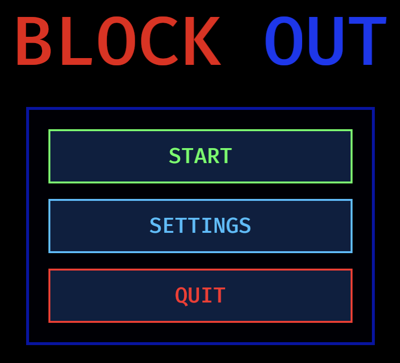
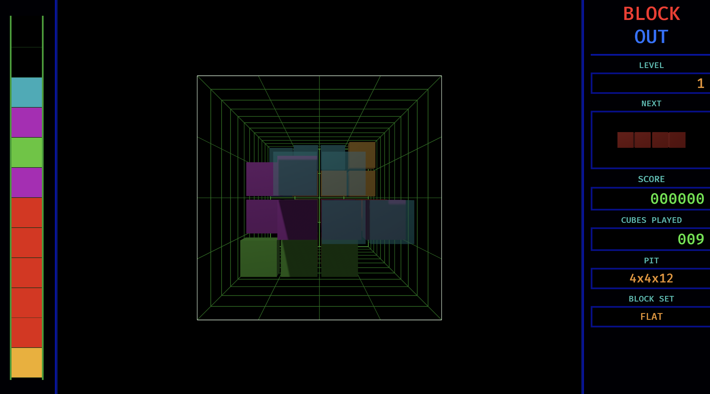
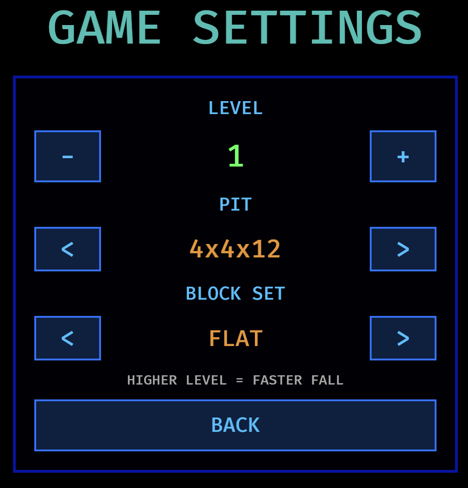

# Blockout

A learning-focused implementation of **Blockout**, a three-dimensional puzzle game, built with Rust and Bevy.

## About the Game

The original **Blockout** was developed in Poland by Aleksander Ustaszewski and Mirosław Zabłocki and published by California Dreams in 1989.

Blockout takes the core idea of Tetris into three dimensions. The player looks down into a pit and positions pieces as they fall away from the camera. The goal is to fill complete cross-sectional layers. Completed layers disappear and award points.

This project is not intended to be an exact reproduction of the original game. It is a learning project for exploring Rust, Bevy, ECS, 3D graphics, and linear algebra.

## Screenshots

### Main Menu

 

### Gameplay



### Settings



## How to Play

A piece appears at the entrance to the pit and automatically moves deeper into it. The active piece is translucent while it is falling. When it reaches the bottom or lands on previously placed blocks, it locks in place and becomes opaque.

Filling an entire cross-sectional layer clears it. Each cleared layer awards `100` points.

The left side of the game screen contains a depth indicator:

- the top of the indicator represents the entrance to the pit;
- the bottom represents the floor;
- colored segments show layers occupied by the active piece or locked blocks.

The right panel shows the next piece, level, score, number of pieces placed, pit dimensions, and selected block set.

## Controls

### Movement

| Key | Action |
|---|---|
| `←` | Move left |
| `→` | Move right |
| `↑` | Move up |
| `↓` | Move down |

### Rotation

| Key | Action |
|---|---|
| `Q` / `A` | Rotate around the X axis in either direction |
| `W` / `S` | Rotate around the Y axis in either direction |
| `E` / `D` | Rotate around the Z axis in either direction |
| `R` | Advance to the next unique 3D orientation |

`R` cycles through the unique orientations available to the current piece, omitting symmetrical duplicates. Orientations that would intersect a wall or a locked block are skipped.

### Other Actions

| Key | Action |
|---|---|
| `Space` | Drop the piece to the lowest available position and lock it in place |
| `Enter` | Alternate hard-drop key |
| `G` | Show or hide the guide line |

## Settings

Open `SETTINGS` from the main menu. Use the `<` and `>` buttons to change a value. The selected settings take effect when a new game starts.

### LEVEL

Controls the automatic fall speed.

- minimum level: `1`;
- maximum level: `10`;
- higher levels make pieces fall faster.

### PIT

Sets the width, height, and depth of the pit.

Available sizes:

| Preset | Dimensions |
|---|---|
| Shallow | `4 × 4 × 8` |
| Classic | `4 × 4 × 12` |
| Wide | `5 × 5 × 14` |

The first two values define the size of the pit entrance. The third value is its depth.

### BLOCK SET

Selects which pieces can appear during the game.

| Set | Contents |
|---|---|
| `FLAT` | Seven classic flat tetrominoes |
| `BASIC 3D` | Three non-planar tetracubes |
| `EXTENDED` | All ten flat and non-planar pieces |

Pieces are drawn from a shuffled bag. Every piece in the selected set appears once before the bag is refilled and shuffled again.

## Running the Project

A stable Rust toolchain is required.

```bash
cargo run
```

Run the test suite with:

```bash
cargo test
```

## Technology

- Rust 2024
- Bevy 0.19

## License

This project is available under the [MIT License](LICENSE).
